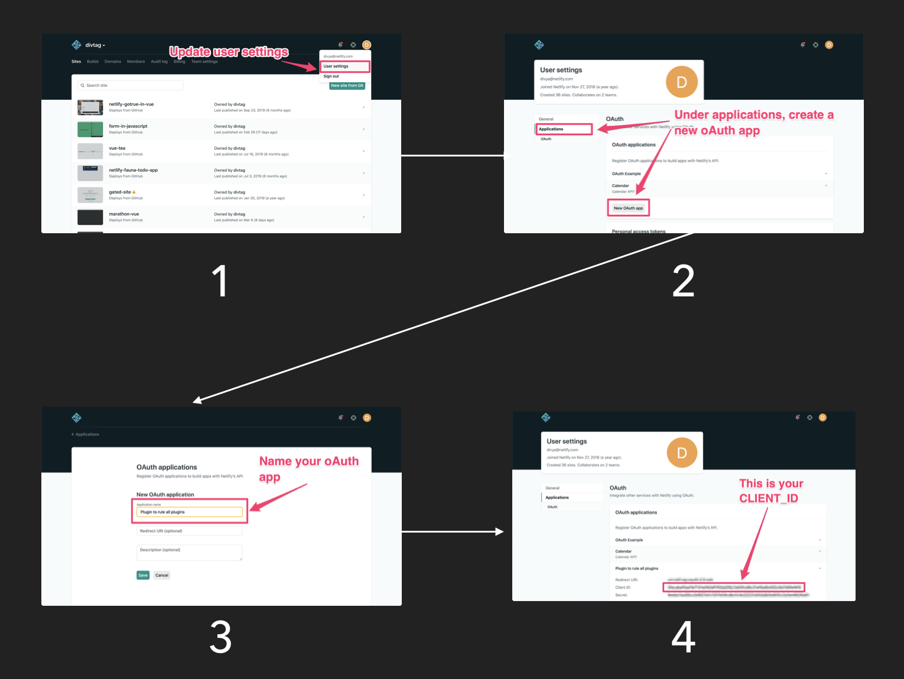

# Netlify Plugin Get Env Vars 

> ⚠️ **This plugin is meant for local development only**

This plugin was created as a way to streamline local build plugin development. Currently when running a plugin locally, there is no way to grab and use environment variables from the UI. This plugin fixes that.

## Usage

### Retrieve Client ID for Auth

Here are the steps to get your client id from your netlify account:

- Step 1: Go to user settings
- Step 2: Under applications, create a new oauth app
- Step 3: Name your oAuth app and add any other attributes like redirects etc
- Step 4: If you click on your newly created oAuth app, you'll be able to easily grab your client id




### Add Client ID
Add this plugin to a project's toml file like so:

```toml
[[plugins]]
package = "./netlify-plugin-get-env-vars"
```

For this plugin to work you will need to include a CLIENT_ID. This will be used for auth purposes and you will have to grant the application access to your application. The CLIENT_ID can either be read in from the plugins inputs or from env vars set in your shell. 

To set CLIENT_ID at the shell level run:
```
export CLIENT_ID="CLIENT_ID_GOES_HERE"
```

To set CLIENT_ID in the plugin inputs add an input like so: 
```
[[plugins]]
package = "./netlify-plugin-get-env-vars"
  [plugins.inputs]
  clientId="SOME_ID_HERE"
```

At the moment, this plugin simply prints the env variables to console, the goal is to be able to pipe them to another build plugin.


## Note: make it such that once auth is granted, the flow doesn't require constant auth grants